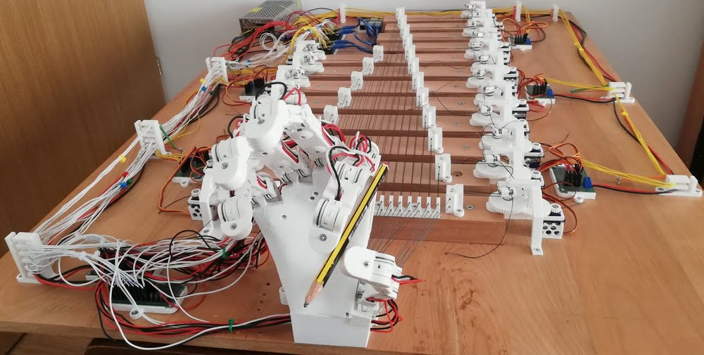
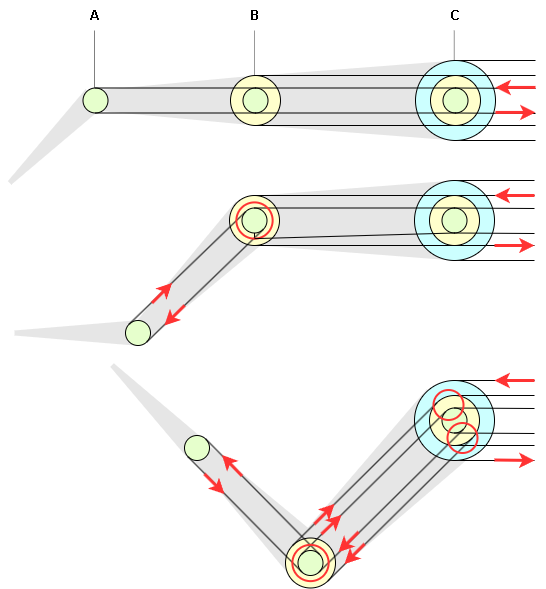
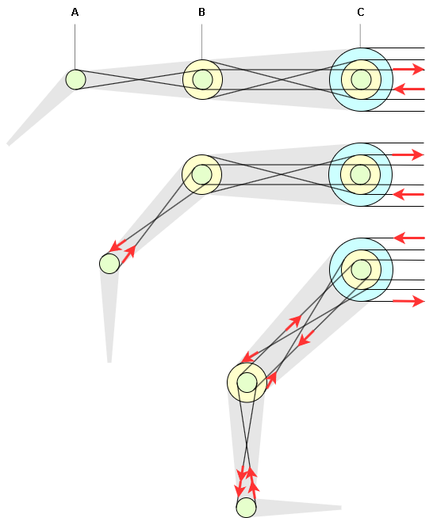
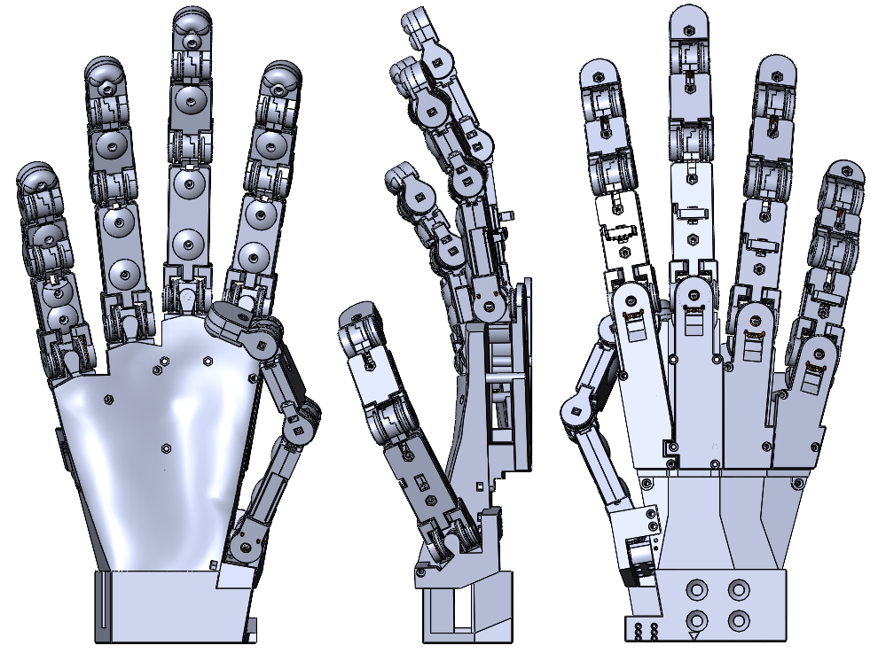
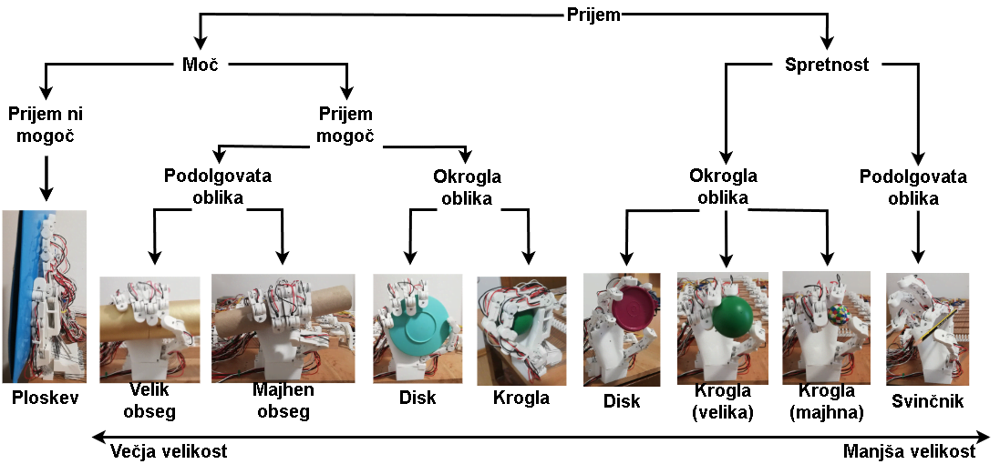

# Biomimetic Anthropomorphic Robotic Hand

  

## Introduction
This repository is a summarization of my diploma thesis, which can be fully read [here](/doc/Biomimetic_Anthropomorphic_Robotic_Hand_Thesis_SLO.pdf). 

The thesis is about designing and manufacturing a working prototype of a 3D printed cable-driven 20-DOF Biomimetic Anthropomorphic Robotic Hand. The main intent was to recreate appropriate hand proportions and joint motions with a simple and modular mechanical structure, which can easily be 3D printed.

## Actuator system

The original idea for moving the joints was to use small "micro" servos in the joints themselves, but I quickly figured that they simply don't provide enough torque to provide consistent motion to the joints (the hand would also become very heavy from the motors and extra cables required). I then pivoted towards cable-driven actuators, where the motors are moved out of the hand entirely. The base cable-pully system was taken from [here](https://www.youtube.com/watch?v=MxbX9iKGd6w&ab_channel=WillCogley). The issue with this system is that moving one joint moves the sequential joint in the opposite direction, I like to call this consequential movement.

I modified the original system by twisting/swapping the cables at specific spots to take advantage of consequential movement to make the finger motion more natural and easier to control. With this change we can actually move all 3 joints of a finger in the same direction with only 1 motor, sadly I figured this out too late and didn't want to modify the rest of the hand. 
The original system and the change are visualized in the following images. The motion is the same in both images (45° flex on each finger joint), but as we can see the final finger position is a lot different:

  
  
  <figcaption>Original cable system left, modified cable system right.</figcaption>

Check out the thesis if you are interested in consequential joint movement. I explain (with simple math/geometry) the cause, amount and direction of consequential movement. In my opinion this cable system modification is the most interesting bit of my thesis. 

## 3-D printed parts

All parts were modeled with SolidWorks (2022/2023) and 3D printed with Creality's Ender-5 (slicer used was CURA 5). Everything that could possibly be printed was printed (an extreme example: the joint axis were 3D printed). Most joints (DIP/PIP) are normal hinge joints, while the rest (MCP/CMC) are 2D joints that use a cross axis. All joints require a lot of small bearings.

A large majority of the project's time was spent on designing the robotic hand as I was referencing the actual anatomical structure of a human hand (proportions and the range of motion of each joint).

  
  <figcaption>Full robotic hand in SolidWorks.</figcaption>

All parts required can be found in `/parts`.

## Code

The joints are split between 4 Arduino Nano's, which handle their PID control. The Arduino code includes potentiometer signal filtering and consequential joint movement error handling to prevent potential breaking (`\src\arduino\Nano_0*_dip\Nano_0*_dip.ino`). Each Arduino is then connected to a Raspberry Pi through USB (UART), so I could control the whole hand through a single input (`\src\raspberry\rpi_code.py`).

The code for each joint is organized into a HandJoint class (`\src\arduino\lib\HandJoint`), so there isn't a ton of repeated code for each joint.

## Result

The first thing that was tested was the operation viability of this prototype by manipulating the hand's fingers through commands on the Raspberry Pi. As seen in the animated GIF below the cable-pully system works great (in regard to moving the joints), the structure of the fingers is also strong enough that the first thing to break is usually the cable/string or rather the way they are attached might slip. The only issue is the finger oscillation. The cable-pully system allows some wiggle room, which when combined with consequential movement of joints and their PID control, makes the detailed control of fingers quite hard. Each joint is trying to correct itself, while another joint keeps disrupting its position. Additional processing of commands would be necessary, e.g. a command would determine the final position of each joint and would then be processed to only require minimal movement on each joint to reach said final position, rather than each joint attempting to reach the final position from the get-go.

  
  <figcaption>Oscillation of the hand's finger.</figcaption>

The second thing that was tested was the grasping ability of the hand's design. This test was done through manual movement of fingers. It followed the grasping taxonomy and is visualized below. Things that were found lacking was no movement in the palm under the little and ring finger (CMC joint) and the thumb orientation. These made grasping in some cases difficult as a correct angle for thumb opposition is required for a truly strong grasp. The other thing that was found was that the adaptability that the lateral movement of fingers offer, wasn't really necessary, specially in the middle and ring fingers. In this case it's possible to reduce structure complexity without reducing grasping capability.

  
  <figcaption>Grasping taxonomy.</figcaption>

## Other comments

- stopped developing code part (kinematics, command processing), because I want to further refine the design first
- stopped further development in general, because a lacking use-case, if we are talking grasping ability in robotics, then we are better off with less complex task specific grippers and if we are talking about bionic hand prosthesis, there is currently too much extra stuff to fit into a reasonable forearm
- might reuse the cable-pully system and my modification for other biomimetic robotic projects, I find this field quite interesting